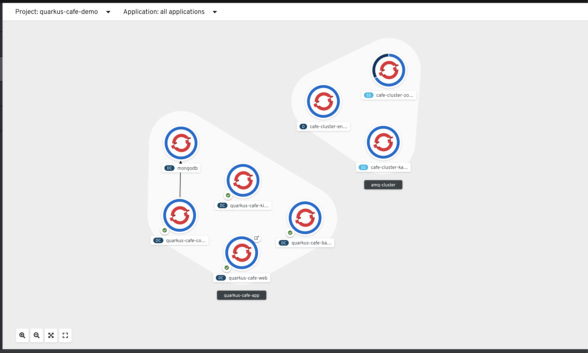
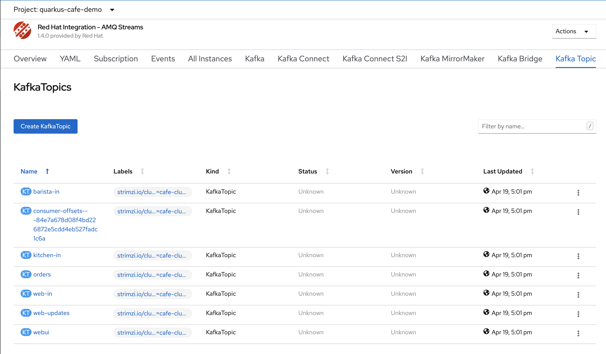
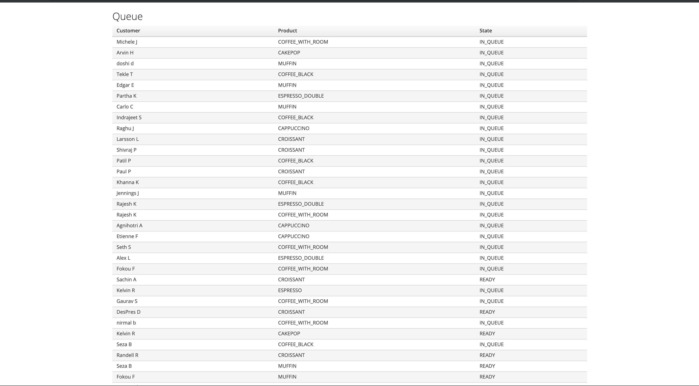

# Quarkus, Kafka, Kubernetes, and Coffee

This repo contains an event-driven demo application built with Quarkus, AMQ Streams (Kafka), and MongoDB.  The application can run locally and in OpenShift (Kubernetes.)

## Overview

The application consists of 4 microservices:
* Web
* Core
* Kitchen
* Barista

There is an additional microservice used for testing: Customermock

### Web

[quarkus-cafe-web](quarkus-cafe-barista/)

This service hosts the web front end and is the initial entry point for all orders.  Orders are sent to a Kafka topic, web-in, where they are picked up by the Core service.

This services listens to the web-updates topic and pushes updates to the web front end.

### Core

quarkus-cafe-core

This service handles the business logic of creating

### Kitchen
quarkus-cafe-kitchen

### Barista
quarkus-cafe-barista

## Documentation and support 
Supporting scripts can be found in the "support" folder

## Quarkus Cafe Deployment Options 
* [Quarkus Cafe Deployment Options ](support/README.md)
  * [Local Deployment Instructions ](support/README.md#local-deployment-instructions)
  * [OpenShift Docker Deployment via Ansible ](support/README.md#openshift-docker-deployment-via-ansible)
  * [Deployment via Helm Chart](support/README.md#deployment-via-helm-chart)
  * [Deployment via ACM - Red Hat Advanced Cluster Management for Kubernetes](support/README.md#deployment-via-helm-chart)

## ScreenShots
**Landing Page**

**quarkus cafe topology**

**kafka topics**

http://quarkus-cafe-web-quarkus-cafe-demo.apps.example.com/cafe example

## Author Information
This was created in 2020 by [Jeremy Davis](https://github.com/jeremyrdavis)
