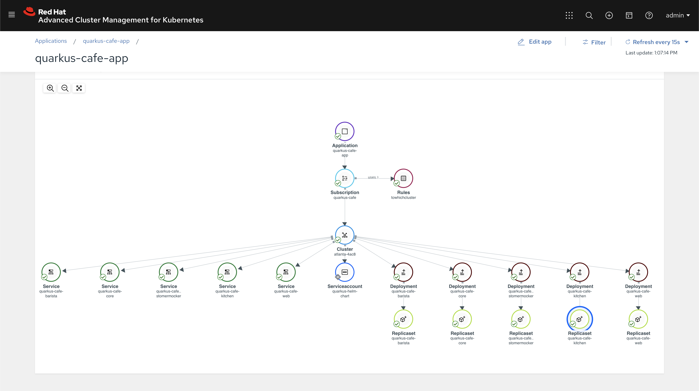

# Quarkus Cafe on ACM


## Provision RHPDS Enviornment 
* OCP4 ACM Hub
* OCP4 ACM Managed


## Install ACM Managed and Configure a HUB

Import an existing cluster


Run Genereated command on target machine 


View Cluster status


## Administrator Tasks On Target Cluster (OCP4 ACM Managed)


### Clone quarkus cafe demo repo locally 
```
git clone https://github.com/jeremyrdavis/quarkus-cafe-demo.git
```

### OpenShift 4.x Instructions 
**Login to OpenShift and create project**
```
oc new-project quarkus-cafe-demo
```

**cd into admin tasks directory**
```
cd quarkus-cafe-demo/support/helm-deployment/admin-tasks
```

**Run ansible playbook to install Red Hat AMQ and mongodb on target cluster**
* [admin-tasks](https://github.com/jeremyrdavis/quarkus-cafe-demo/blob/master/support/helm-deployment/admin-tasks/README.md)


## Deploy ArgoCD on OCP4 ACM Hub
1. Create argocd project 
```
oc new-project argocd
```
2. Install argocd community operator 
